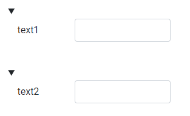

# Генератор форм

## Введение

Генератор предназначен для рендера форм в разных видах (таблица, форма)
#### Модуль разделен на 3 части

 1. **creator** -  сервис и логика генерации formGroup из json-конфигурации 
 2. **components-view** - базовые компоненты видов
 3. **template** - шаблоны отбражения formGroup

## Быстрый старт
### Конфиг формы
#### Поля
  

	<app-form [formConfig ]="config"></appform>
	
    config = {
        fields: [
	        {fieldName: 'text1', type: 'text'},  
            {fieldName: 'text2', type: 'text'},
		 ]
	};

### Установка данных

Через  value поля в json-конфигурации

    {fieldName: 'text1', type: 'text', value: 'ТЕКСТ'}, 

Массивом

	<app-form [dataForm]="data" [formConfig ]="config"></appform>
	
    data = {
    	text1: 'test',
    	text2: 'test',
    }

### Валидаторы
### Шаблонизация
[enter link description here](../creator/validators.ts)

